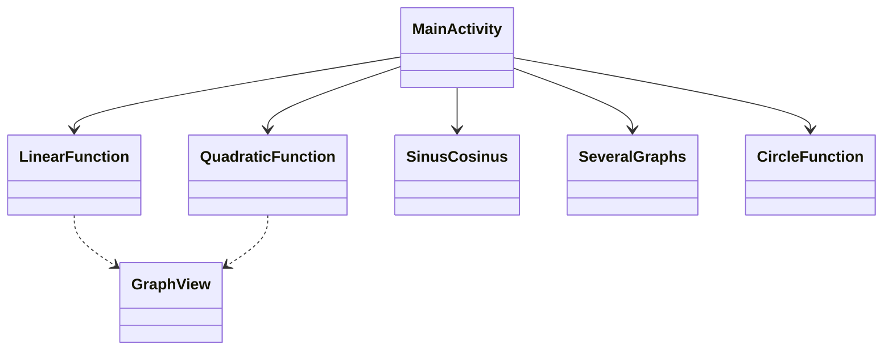

# 📱 توثيق تطبيق أندرويد (المستوى 10/10)

---

## 🧾 معلومات عامة
**اسم المشروع:**
MyMathGraph
**المؤلف (المؤلفون):**
زئيف فرايمان (Zeev Fraiman)
**التاريخ:**
مايو 2024
**اللغة:**
Java
**بيئة التطوير:**
Android Studio
**إصدار أندرويد (minSdk / targetSdk):**
28 / 35

---

## 🎯 هدف المشروع
*   **المشكلة التي يحلها التطبيق:** يوفر التطبيق تمثيلاً مرئياً لمختلف الدوال الرياضية (الخطية، التربيعية، المثلثية، الدوائر) بناءً على المعاملات التي يحددها المستخدم.
*   **الأهمية:** يساعد تصور الدوال الرياضية الطلاب والمعلمين على فهم سلوك المعادلات وتأثير معاملاتها بشكل أفضل.
*   **الجمهور المستهدف:** الطلاب والمعلمون وأي شخص مهتم بالرياضيات.

---

## 📌 متطلبات التطبيق
### المتطلبات الوظيفية
*   رسم الدوال الخطية ($y = ax + b$).
*   رسم الدوال التربيعية ($y = ax^2 + bx + c$).
*   تصور الدوال المثلثية (الجيب وجيب التمام) مع إزاحة الطور.
*   عرض رسوم بيانية متعددة في وقت واحد للمقارنة.
*   استكشاف تفاعلي للرسوم البيانية (النقر على النقاط لرؤية الإحداثيات).

### المتطلبات غير الوظيفية
*   **الأداء:** عرض سريع للرسوم البيانية باستخدام مكتبة `GraphView`.
*   **سهولة الاستخدام:** واجهة بسيطة وبديهية مع قائمة رئيسية لسهولة التنقل.
*   **الموثوقية:** التعامل مع مدخلات رياضية متنوعة وتوفير تصور مستقر.

---

## 🧠 الهيكل العام
*   **النهج المختار:**
    *   يعتمد على الأنشطة (Activity-based) (نمط MVC مبسط حيث تدير الـ Activity كلاً من واجهة المستخدم والمنطق).
*   **سبب اختيار هذا النهج:** بالنسبة لتطبيق يركز على الأدوات مع شاشات مستقلة لمختلف الدوال، فإن النهج المباشر المعتمد على الأنشطة فعال وسهل الصيانة.
*   **المكونات الرئيسية للنظام:**
    *   `MainActivity`: القائمة الرئيسية والتنقل.
    *   `LinearFunction`, `QuadraticFunction`, `SinusCosinus`, `SeveralGraphs`, `CircleFunction`: أنشطة مخصصة لتصورات رياضية محددة.

---

## 🧩 مخطط UML

---

## 🧩 وصف تفصيلي للفئات
### 📌 الفئة: MainActivity
*   **الدور:** نقطة الدخول للتطبيق.
*   **المسؤولية:** توفر واجهة مستخدم لاختيار نوع الدالة المراد تصورها.
*   **الأساليب الرئيسية:**
    *   `onCreate()`: تهيئة التخطيط.
    *   `goLinear()`, `goQuadratic()`, `goSeveral()`, `goSinCos()`: أساليب التنقل لفتح الأنشطة المقابلة.
*   **التفاعل:** يبدأ الأنشطة الأخرى عبر Intents.

### 📌 الفئة: QuadraticFunction
*   **الدور:** منطق تصور الدالة التربيعية.
*   **المسؤولية:** تأخذ المعاملات $a, b, c$، وتحسب النقاط، وترسم القطع المكافئ.
*   **الأساليب الرئيسية:**
    *   `viewGraph()`: المنطق الرئيسي لتوليد نقاط البيانات وعرضها.
*   **التفاعل:** يستخدم `GraphView` لعرض النتيجة.

---

## 🔄 سيناريو عمل التطبيق
1.  يفتح المستخدم التطبيق ويرى القائمة الرئيسية.
2.  يختار المستخدم نوع الدالة (مثل التربيعية).
3.  يدخل المستخدم المعاملات ($a, b, c$).
4.  ينقر المستخدم على "عرض الرسم البياني".
5.  يحسب التطبيق الرأس، والجذور (إن وجدت)، ويولد سلسلة من النقاط لعرضها في `GraphView`.

---

## 🎨 تحليل UI/UX
*   **تصميم الواجهة:** نظيف ومركز على منطقة الرسم البياني.
*   **المبادئ المستخدمة:**
    *   **البساطة:** لا توجد عناصر غير ضرورية؛ التركيز على المدخلات والرسم البياني.
    *   **المنطقية:** تدفق من اليسار إلى اليمين أو من الأعلى إلى الأسفل (مدخلات -> زر -> رسم بياني).
*   **ما يمكن تحسينه:** يمكن إضافة منتقي ألوان للرسوم البيانية أو القدرة على حفظ الرسوم البيانية كصور.

---

## ⚙️ العمل مع الخيوط (Threads)
*   **المستخدم:** بشكل أساسي الخيط الرئيسي (Main Thread) للحساب والعرض.
*   **سبب اختيار هذا الأسلوب:** الحسابات الرياضية لهذه الدوال خفيفة ولا تعيق خيط واجهة المستخدم.
*   **منع التعليق:** تم تحسين توليد النقاط لمنع تأخير واجهة المستخدم.

---

## 💾 إدارة البيانات
*   **التخزين:** بيانات مؤقتة (مدخلات في EditText).
*   **سبب اختيار هذا الأسلوب:** لا حاجة لتخزين دائم للتصورات البسيطة؛ يتم إعادة إدخال البيانات من قبل المستخدم حسب الحاجة.

---

## 🧪 الاختبار
*   **اختبارات الوحدة (Unit Tests):** التحقق من الحسابات الرياضية (الجذور، الرأس).
*   **اختبارات واجهة المستخدم (UI Tests):** التحقق من التنقل ومشغلات رسم الرسوم البيانية.

---

## 🐞 معالجة الأخطاء
*   **التحقق من المدخلات:** فحوصات أساسية للحقول الفارغة.
*   **الأمان الرياضي:** التعامل مع الحالات التي لا توجد فيها جذور حقيقية في الدوال التربيعية من خلال توسيط العرض على الرأس.

---

## ⚡ الأداء
*   **التحسين:** يستخدم `appendData` مع عدد ثابت من النقاط (مثلاً 100 أو 720) لضمان عرض سلس.
*   **الاختناقات:** مجموعات البيانات الضخمة جداً قد تبطئ العرض، لكن الحدود الحالية تقع ضمن نطاق الأداء الجيد.

---

## 🚀 إمكانيات التوسع
*   إضافة دعم لدوال أكثر تعقيداً (اللوغاريتمية، الأسية).
*   تصور الرسوم البيانية ثلاثية الأبعاد (3D).
*   تصدير بيانات الرسم البياني إلى ملفات CSV أو PDF.
