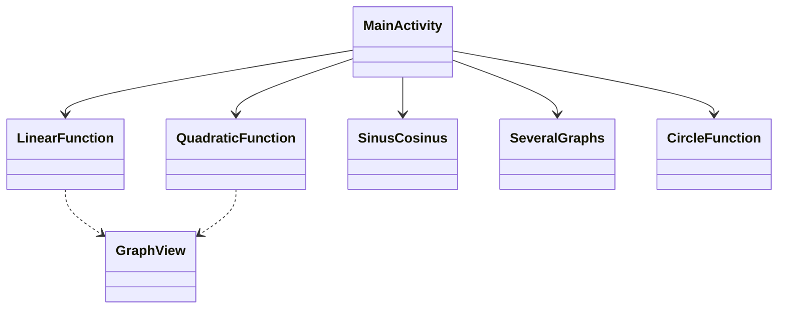

# 📱 Android Application Documentation (LEVEL 10/10)

---

## 🧾 General Information
**Project Name:**
MyMathGraph
**Author(s):**
Zeev Fraiman
**Date:**
May 2024
**Language:**
Java
**Development Environment:**
Android Studio
**Android Version (minSdk / targetSdk):**
28 / 35

---

## 🎯 Project Goal
*   **Problem Solved:** The application provides a visual representation of various mathematical functions (linear, quadratic, trigonometric, circles) based on user-defined coefficients.
*   **Importance:** Visualizing mathematical functions helps students and educators better understand the behavior of equations and the impact of their parameters.
*   **Target Audience:** Students, teachers, and anyone interested in mathematics.

---

## 📌 Application Requirements
### Functional Requirements
*   Plot linear functions ($y = ax + b$).
*   Plot quadratic functions ($y = ax^2 + bx + c$).
*   Visualize trigonometric functions (Sine and Cosine) with phase shifts.
*   Display multiple graphs simultaneously for comparison.
*   Interactive graph exploration (tap on points to see coordinates).

### Non-functional Requirements
*   **Performance:** Fast rendering of graphs using the `GraphView` library.
*   **Usability:** Simple and intuitive interface with a main menu for easy navigation.
*   **Reliability:** Handles various mathematical inputs and provides stable visualization.

---

## 🧠 General Architecture
*   **Chosen Approach:**
    *   Activity-based (Simplified MVC where the Activity manages both the UI and the logic).
*   **Why this approach:** For a utility-focused application with independent screens for different functions, a direct Activity-based approach is efficient and easy to maintain.
*   **Main Components:**
    *   `MainActivity`: Main menu and navigation.
    *   `LinearFunction`, `QuadraticFunction`, `SinusCosinus`, `SeveralGraphs`, `CircleFunction`: Dedicated activities for specific mathematical visualizations.

---

## 🧩 UML Diagram

---

## 🧩 Detailed Class Description
### 📌 Class: MainActivity
*   **Role:** Entry point of the application.
*   **Responsibility:** Provides a user interface to choose which type of function to visualize.
*   **Main Methods:**
    *   `onCreate()`: Initializes the layout.
    *   `goLinear()`, `goQuadratic()`, `goSeveral()`, `goSinCos()`: Navigation methods to launch corresponding activities.
*   **Interaction:** Starts other activities via Intents.

### 📌 Class: QuadraticFunction
*   **Role:** Logic for quadratic function visualization.
*   **Responsibility:** Takes $a, b, c$ parameters, calculates points, and renders the parabola.
*   **Main Methods:**
    *   `viewGraph()`: Main logic for data point generation and display.
*   **Interaction:** Uses `GraphView` to display the result.

---

## 🔄 Application Workflow
1.  User opens the app and sees the main menu.
2.  User selects a function type (e.g., Quadratic).
3.  User enters coefficients ($a, b, c$).
4.  User clicks "View Graph".
5.  The app calculates the vertex, roots (if any), and generates a series of points to render on the `GraphView`.

---

## 🎨 UI/UX Analysis
*   **Interface Design:** Clean and focused on the graph area.
*   **Principles used:**
    *   **Simplicity:** No unnecessary elements; focus on inputs and the graph.
    *   **Logicality:** Left-to-right or Top-to-bottom flow (Input -> Button -> Graph).
*   **Improvements:** Could add color pickers for graphs or the ability to save graphs as images.

---

## ⚙️ Threading
*   **Used:** Mainly the Main Thread for calculation and rendering.
*   **Reason:** Mathematical calculations for these functions are lightweight and don't block the UI thread.
*   **Prevention:** Point generation is optimized to prevent UI lag.

---

## 💾 Data Management
*   **Storage:** Transient data (inputs in EditText).
*   **Reason:** No need for persistent storage for simple visualization; data is re-entered by the user as needed.

---

## 🧪 Testing
*   **Unit Tests:** Verification of mathematical calculations (roots, vertex).
*   **UI Tests:** Verification of navigation and graph rendering triggers.

---

## 🐞 Error Handling
*   **Input Validation:** Basic checks for empty fields.
*   **Mathematical Safety:** Handling cases with no real roots in quadratic functions by centering the view on the vertex.

---

## ⚡ Performance
*   **Optimization:** Uses `appendData` with a fixed number of points (e.g., 100 or 720) to ensure smooth rendering.
*   **Bottlenecks:** Extremely large datasets could slow down rendering, but current limits are well within performance bounds.

---

## 🚀 Expansion Possibilities
*   Adding support for more complex functions (Logarithmic, Exponential).
*   3D graph visualization.
*   Exporting graph data to CSV or PDF.
