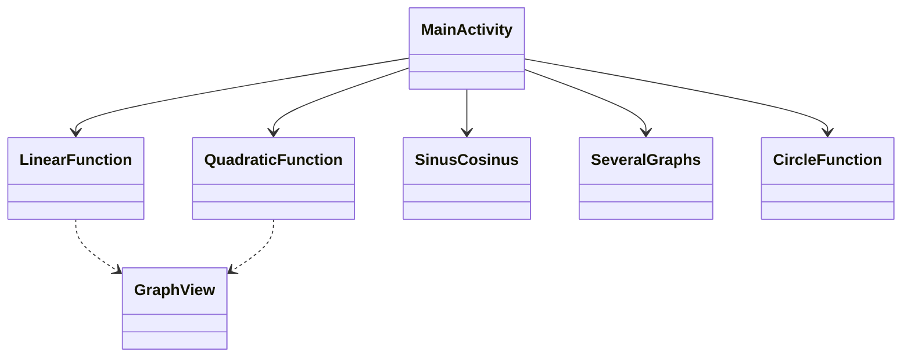

# 📱 תיעוד אפליקציית אנדרואיד (רמה 10/10)

---

## 🧾 מידע כללי
**שם הפרויקט:**
MyMathGraph
**מחבר(ים):**
זאב פריימן (Zeev Fraiman)
**תאריך:**
מאי 2024
**שפה:**
Java
**סביבת פיתוח:**
Android Studio
**גרסת אנדרואיד (minSdk / targetSdk):**
28 / 35

---

## 🎯 מטרת הפרויקט
*   **הבעיה שהאפליקציה פותרת:** האפליקציה מספקת ייצוג ויזואלי של פונקציות מתמטיות שונות (ליניאריות, ריבועיות, טריגונומטריות, מעגלים) על סמך מקדמים המוגדרים על ידי המשתמש.
*   **חשיבות:** המחשת פונקציות מתמטיות עוזרת לתלמידים ולמחנכים להבין טוב יותר את התנהגות המשוואות ואת השפעת הפרמטרים שלהן.
*   **קהל יעד:** תלמידים, מורים וכל מי שמתעניין במתמטיקה.

---

## 📌 דרישות האפליקציה
### דרישות פונקציונליות
*   שרטוט פונקציות ליניאריות ($y = ax + b$).
*   שרטוט פונקציות ריבועיות ($y = ax^2 + bx + c$).
*   המחשת פונקציות טריגונומטריות (סינוס וקוסינוס) עם הזזות פאזה.
*   הצגת מספר גרפים בו-זמנית להשוואה.
*   חקירת גרפים אינטראקטיבית (לחיצה על נקודות לצפייה בקואורדינטות).

### דרישות לא פונקציונליות
*   **ביצועים:** רינדור מהיר של גרפים באמצעות ספריית `GraphView`.
*   **חווית משתמש:** ממשק פשוט ואינטואיטיבי עם תפריט ראשי לניווט קל.
*   **אמינות:** טיפול בקלטים מתמטיים מגוונים ומתן המחשה יציבה.

---

## 🧠 ארכיטקטורה כללית
*   **הגישה שנבחרה:**
    *   מבוסס Activity (MVC מפושט שבו ה-Activity מנהלת הן את ממשק המשתמש והן את הלוגיקה).
*   **למה נבחרה גישה זו:** עבור אפליקציה ממוקדת כלי עזר עם מסכים עצמאיים לפונקציות שונות, גישה ישירה מבוססת Activity היא יעילה וקלה לתחזוקה.
*   **מרכיבי המערכת העיקריים:**
    *   `MainActivity`: תפריט ראשי וניווט.
    *   `LinearFunction`, `QuadraticFunction`, `SinusCosinus`, `SeveralGraphs`, `CircleFunction`: מסכים ייעודיים להמחשות מתמטיות ספציפיות.

---

## 🧩 דיאגרמת UML

---

## 🧩 תיאור מפורט של מחלקות
### 📌 מחלקה: MainActivity
*   **תפקיד:** נקודת הכניסה לאפליקציה.
*   **אחריות:** מספקת ממשק משתמש לבחירת סוג הפונקציה להמחשה.
*   **שיטות עיקריות:**
    *   `onCreate()`: מאתחלת את הפריסה (Layout).
    *   `goLinear()`, `goQuadratic()`, `goSeveral()`, `goSinCos()`: שיטות ניווט להפעלת המסכים המתאימים.
*   **אינטראקציה:** מפעילה Activities אחרות באמצעות Intents.

### 📌 מחלקה: QuadraticFunction
*   **תפקיד:** לוגיקה להמחשת פונקציה ריבועית.
*   **אחריות:** מקבלת פרמטרים $a, b, c$, מחשבת נקודות ומרנדרת את הפרבולה.
*   **שיטות עיקריות:**
    *   `viewGraph()`: לוגיקה מרכזית ליצירת נקודות נתונים והצגתן.
*   **אינטראקציה:** משתמשת ב-`GraphView` להצגת התוצאה.

---

## 🔄 תרחיש עבודה של האפליקציה
1.  המשתמש פותח את האפליקציה ורואה את התפריט הראשי.
2.  המשתמש בוחר סוג פונקציה (למשל, ריבועית).
3.  המשתמש מזין מקדמים ($a, b, c$).
4.  המשתמש לוחץ על "View Graph".
5.  האפליקציה מחשבת את הקודקוד, שורשים (אם קיימים), ומייצרת סדרת נקודות לרינדור ב-`GraphView`.

---

## 🎨 ניתוח UI/UX
*   **עיצוב הממשק:** נקי וממוקד באזור הגרף.
*   **עקרונות בשימוש:**
    *   **פשטות:** ללא אלמנטים מיותרים; התמקדות בקלטים ובגרף.
    *   **לוגיקה:** זרימה משמאל לימין או מלמעלה למטה (קלט -> כפתור -> גרף).
*   **מה ניתן לשפר:** ניתן להוסיף בחירת צבעים לגרפים או אפשרות לשמור גרפים כתמונות.

---

## ⚙️ עבודה עם תהליכונים (Threads)
*   **בשימוש:** בעיקר ה-Main Thread לחישוב ורינדור.
*   **למה נבחרה דרך זו:** חישובים מתמטיים עבור פונקציות אלו הם קלים ואינם חוסמים את ממשק המשתמש.
*   **מניעת תקיעות:** יצירת הנקודות מותאמת למניעת השהיות בממשק המשתמש.

---

## 💾 ניהול נתונים
*   **אחסון:** נתונים זמניים (קלטים ב-EditText).
*   **למה נבחרה דרך זו:** אין צורך באחסון קבוע עבור המחשה פשוטה; הנתונים מוזנים מחדש על ידי המשתמש לפי הצורך.

---

## 🧪 בדיקות
*   **בדיקות יחידה (Unit Tests):** אימות חישובים מתמטיים (שורשים, קודקוד).
*   **בדיקות UI:** אימות ניווט וטריגרים לרינדור גרפים.

---

## 🐞 טיפול בשגיאות
*   **אימות קלט:** בדיקות בסיסיות לשדות ריקים.
*   **בטיחות מתמטית:** טיפול במקרים ללא שורשים ממשיים בפונקציות ריבועיות על ידי מרכוז התצוגה על הקודקוד.

---

## ⚡ ביצועים
*   **אופטימיזציה:** שימוש ב-`appendData` עם מספר קבוע של נקודות (למשל, 100 או 720) להבטחת רינדור חלק.
*   **צווארי בקבוק:** סטים גדולים מאוד של נתונים עלולים להאיט את הרינדור, אך המגבלות הנוכחיות נמצאות בטווח הביצועים התקין.

---

## 🚀 אפשרויות הרחבה
*   הוספת תמיכה בפונקציות מורכבות יותר (לוגריתמיות, מעריכיות).
*   המחשת גרפים בתלת-ממד (3D).
*   ייצוא נתוני גרף ל-CSV או PDF.
