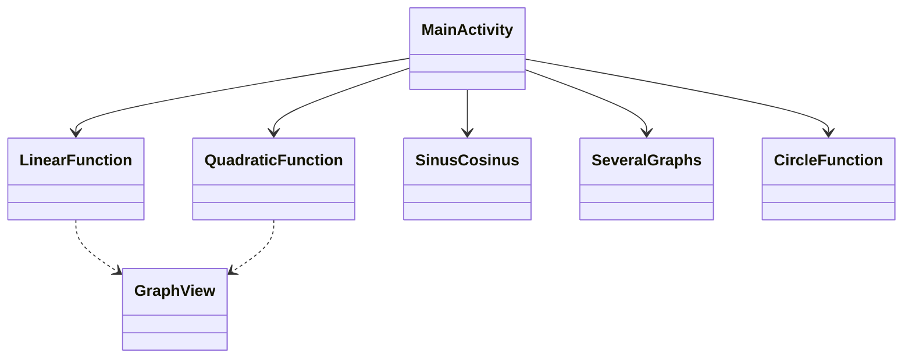

# 📱 Документация Android-приложения (УРОВЕНЬ 10/10)

---

## 🧾 Общая информация
**Название проекта:**
MyMathGraph
**Автор(ы):**
Zeev Fraiman
**Дата:**
Май 2024
**Язык:**
Java
**Среда разработки:**
Android Studio
**Версия Android (minSdk / targetSdk):**
28 / 35

---

## 🎯 Цель проекта
*   **Какую задачу решает приложение:** Приложение обеспечивает визуальное представление различных математических функций (линейных, квадратичных, тригонометрических, окружностей) на основе коэффициентов, заданных пользователем.
*   **Почему эта задача важна:** Визуализация математических функций помогает студентам и преподавателям лучше понять поведение уравнений и влияние их параметров.
*   **Целевая аудитория:** Студенты, преподаватели и все, кто интересуется математикой.

---

## 📌 Требования к приложению
### Функциональные требования
*   Построение графиков линейных функций ($y = ax + b$).
*   Построение графиков квадратичных функций ($y = ax^2 + bx + c$).
*   Визуализация тригонометрических функций (синус и косинус) с фазовыми сдвигами.
*   Отображение нескольких графиков одновременно для сравнения.
*   Интерактивное исследование графиков (нажатие на точки для просмотра координат).

### Нефункциональные требования
*   **Производительность:** Быстрая отрисовка графиков с использованием библиотеки `GraphView`.
*   **Удобство использования:** Простой и интуитивно понятный интерфейс с главным меню для легкой навигации.
*   **Надёжность:** Корректная обработка различных математических входных данных и стабильная визуализация.

---

## 🧠 Общая архитектура
*   **Выбранный подход:**
    *   На основе Activity (упрощенный MVC, где Activity управляет как пользовательским интерфейсом, так и логикой).
*   **Почему выбран именно он:** Для утилитарного приложения с независимыми экранами для различных функций прямой подход на основе Activity эффективен и прост в поддержке.
*   **Основные компоненты системы:**
    *   `MainActivity`: Главное меню и навигация.
    *   `LinearFunction`, `QuadraticFunction`, `SinusCosinus`, `SeveralGraphs`, `CircleFunction`: Специализированные Activity для конкретных математических визуализаций.

---

## 🧩 UML-диаграмма

---

## 🧩 Подробное описание классов
### 📌 Класс: MainActivity
*   **Роль:** Точка входа в приложение.
*   **Ответственность:** Предоставляет пользовательский интерфейс для выбора типа визуализируемой функции.
*   **Основные методы:**
    *   `onCreate()`: Инициализирует макет.
    *   `goLinear()`, `goQuadratic()`, `goSeveral()`, `goSinCos()`: Методы навигации для запуска соответствующих Activity.
*   **Взаимодействие с другими классами:** Запускает другие Activity через Intent.

### 📌 Класс: QuadraticFunction
*   **Роль:** Логика визуализации квадратичной функции.
*   **Ответственность:** Принимает параметры $a, b, c$, вычисляет точки и отрисовывает параболу.
*   **Основные методы:**
    *   `viewGraph()`: Основная логика генерации и отображения точек данных.
*   **Взаимодействие с другими классами:** Использует `GraphView` для отображения результата.

---

## 🔄 Диаграмма работы приложения
1.  Пользователь открывает приложение и видит главное меню.
2.  Пользователь выбирает тип функции (например, квадратичную).
3.  Пользователь вводит коэффициенты ($a, b, c$).
4.  Пользователь нажимает «Посмотреть график».
5.  Приложение вычисляет вершину, корни (если они есть) и генерирует серию точек для отрисовки в `GraphView`.

---

## 🎨 UI/UX анализ
*   **Дизайн интерфейса:** Чистый и сфокусированный на области графика.
*   **Использованные принципы:**
    *   **Простота:** Нет лишних элементов; фокус на вводе данных и графике.
    *   **Логичность:** Поток слева направо или сверху вниз (Ввод -> Кнопка -> График).
*   **Что можно улучшить:** Можно добавить выбор цвета для графиков или возможность сохранять графики в виде изображений.

---

## ⚙️ Работа с потоками
*   **Используется:** В основном главный поток (Main Thread) для вычислений и отрисовки.
*   **Почему выбран этот способ:** Математические вычисления для этих функций легки и не блокируют поток пользовательского интерфейса.
*   **Как предотвращаются зависания:** Генерация точек оптимизирована (ограниченное количество точек), чтобы предотвратить задержки интерфейса.

---

## 💾 Работа с данными
*   **Где хранятся данные:** Временные данные (ввод в EditText).
*   **Почему выбран этот способ:** Нет необходимости в постоянном хранении для простой визуализации; данные повторно вводятся пользователем по мере необходимости.

---

## 🧪 Тестирование
*   **Unit-тесты:** Проверка математических расчетов (корни, вершина).
*   **UI-тесты:** Проверка навигации и триггеров отрисовки графиков.

---

## 🐞 Обработка ошибок
*   **Валидация ввода:** Базовые проверки пустых полей.
*   **Математическая безопасность:** Обработка случаев отсутствия действительных корней в квадратичных функциях путем центрирования вида на вершине.

---

## ⚡ Производительность
*   **Оптимизация:** Использует `appendData` с фиксированным количеством точек (например, 100 или 720) для обеспечения плавной отрисовки.
*   **Узкие места:** Чрезвычайно большие наборы данных могут замедлить рендеринг, но текущие ограничения находятся в пределах производительности.

---

## 🚀 Возможности расширения
*   Добавление поддержки более сложных функций (логарифмических, экспоненциальных).
*   Визуализация 3D-графиков.
*   Экспорт данных графиков в CSV или PDF.
